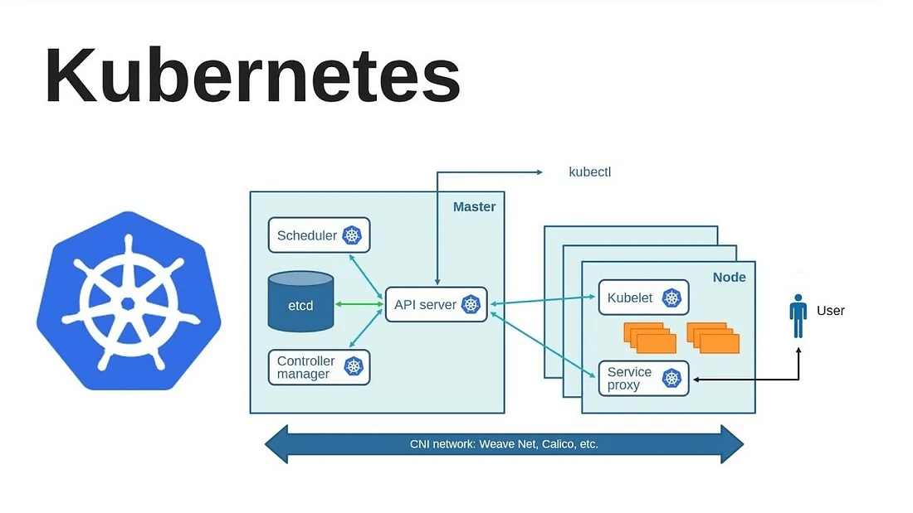

# Kubernetes Tools Overview

This document provides an overview of three key Kubernetes tools—`kubectl`, `kubeadm`, and `kubefed`—each with unique use cases for managing Kubernetes clusters.

## Tools

| Tool      | Description                                                                                  |
|-----------|----------------------------------------------------------------------------------------------|
| **kubectl**  | A command-line tool for interacting with Kubernetes clusters in a single cloud environment. |
| **kubeadm**  | Designed to bootstrap and configure Kubernetes clusters on-premises.                       |
| **kubefed**  | A tool for hybrid environments, enabling federation across cloud and on-premises clusters.  |

### Usage Examples

- **kubectl**: Ideal for managing and deploying applications on a single cloud-based Kubernetes cluster.
- **kubeadm**: Useful for initializing and managing clusters on local or on-premises hardware.
- **kubefed**: Helps in federating multiple clusters, whether in cloud, on-premises, or hybrid setups, enabling unified management.

# Kubernetes Architecture

This document provides a simplified overview of the Kubernetes (K8s) architecture, detailing its primary components and their interactions.

## Architecture Overview

Kubernetes architecture consists of two main sections: the **Control Plane** and the **Worker Nodes**.

### 1. Control Plane Components
   - **API Server**: Acts as the front-end for the Kubernetes control plane. All external and internal interactions with the cluster go through the API Server.
   - **Etcd**: A key-value store that holds all cluster data, including configuration data, state information, and metadata.
# 📘 Understanding etcd in Kubernetes

## 🧠 What is `etcd`?

`etcd` is the **central brain** or **memory** of a Kubernetes cluster.

It is a **key-value store** used by Kubernetes to store all cluster data, including:

- Pod and Node information
- Configuration settings
- Deployment details
- Secrets and ConfigMaps

---

## 📦 Think of It Like This:

Imagine your cluster is a school:

- 🏫 Students → Pods  
- 👨‍🏫 Teachers → Nodes  
- 📋 Rules → ConfigMaps, Secrets  
- 🛠️ Schedules → Deployments, Services

`etcd` is the **logbook** that keeps track of everything.

---

## 🔐 Key Features:

- Stores **cluster state** and desired state
- Provides **consistency and high availability**
- Used by the **Kubernetes API server** to read/write data

---


   - **Controller Manager**: Manages controllers that ensure the cluster's desired state matches its actual state, handling nodes, endpoints, and replication.🛠️ What is the Controller Manager?
     The Controller Manager is like the supervisor in a factory.It watches the cluster and takes action to make sure the current state matches the desired state (as defined in your YAML files).
     🧠 It manages different controllers like:

Controller Type	What It Does
Node Controller	Checks if nodes are up and healthy.
ReplicaSet Controller	Makes sure the correct number of Pods are running.
Deployment Controller	Ensures rolling updates or rollbacks happen smoothly.
Job Controller	Manages batch jobs (run-to-completion tasks).
📌 Example:
If you say, “I want 3 Pods,” and one Pod crashes, the Controller Manager notices and spins up a new Pod to replace it.


   - **Scheduler**: Determines on which nodes new pods should be placed, based on resource requirements and the current workload.
The Scheduler is like the HR person assigning employees to workstations.

When a new Pod is created, the Scheduler decides which node (machine) it should run on based on:

✅ Available resources (CPU, RAM)
✅ Taints and tolerations
✅ Node affinity rules
✅ Workload distribution

📌 Example:
You request a new Pod → It’s created → Scheduler looks at all nodes and picks the best one → Pod is assigned to that node.

🧠 In Simple Words:

Component	Role
Controller Manager	Keeps everything in the cluster working as expected. Fixes problems automatically.
Scheduler	Decides where (which node) to run new Pods.

### 2. Worker Node Components
   - **Kubelet**: An agent running on each worker node, responsible for starting, stopping, and maintaining applications (containers).
   - **Kube-Proxy**: Manages network connectivity and traffic routing between nodes and services within the cluster.
   - **Container Runtime**: The software responsible for running containers, such as Docker or containerd.

### 3. Additional Kubernetes Objects
   - **Pod**: The smallest and simplest Kubernetes object. Each pod represents a single instance of a running application.
   - **Service**: An abstraction layer that defines a logical set of pods and a policy for accessing them.
   - **Persistent Storage**: Allows for the storage of data that needs to persist beyond the lifetime of a pod.
# 🛠️ ConfigMaps and Secrets in Kubernetes

## 🔧 ConfigMap

### ➤ What is it?
A ConfigMap is a Kubernetes object used to store **non-sensitive** key-value pairs.

### ➤ Use Cases:
- Environment variables
- App configuration files
- Command-line arguments

### ➤ Example:

```yaml
apiVersion: v1
kind: ConfigMap
metadata:
  name: my-config
data:
  APP_MODE: "production"
  LOG_LEVEL: "debug"

## Architecture Diagram

The following diagram illustrates the Kubernetes architecture in an easy-to-understand layout:




This image shows the key components of the Control Plane and Worker Nodes, along with arrows indicating the flow of communication.

---

For more detailed documentation on each component, refer to the [Kubernetes official documentation](https://kubernetes.io/docs/).

## Additional Resources

- [Kubernetes Documentation](https://kubernetes.io/docs/)
- [kubectl Command Reference](https://kubernetes.io/docs/reference/kubectl/)
- [kubeadm Setup Guide](https://kubernetes.io/docs/setup/production-environment/tools/kubeadm/install-kubeadm/)
- [kubefed User Guide](https://kubernetes.io/docs/tasks/federation/federation/)


# Basic Kubernetes Commands

This document contains the most commonly used Kubernetes commands for managing your cluster.

## Cluster Information

- **Get Cluster Info**
  ```bash
  kubectl cluster-info
  ```
## Deploy an Application:

```bash
kubectl apply -f <deployment.yaml>
```

## Node Management

- **Get Nodes**
  ```bash
  kubectl get nodes
  ```

## Pod Management

- **Get All Pods**
  ```bash
  kubectl get pods
  ```

- **Get Pods in a Specific Namespace**
  ```bash
  kubectl get pods -n <namespace>
  ```

- **Describe a Pod**
  ```bash
  kubectl describe pod <pod-name>
  ```

- **Delete a Pod**
  ```bash
  kubectl delete pod <pod-name>
  ```

## Deployment Management

- **Create a Deployment**
  ```bash
  kubectl create deployment <deployment-name> --image=<image-name>
  ```

- **Get Deployments**
  ```bash
  kubectl get deployments
  ```

- **Scale a Deployment**
  ```bash
  kubectl scale deployment <deployment-name> --replicas=<number>
  ```

- **Expose a Deployment as a Service**
  ```bash
  kubectl expose deployment <deployment-name> --type=<service-type> --port=<port>
  ```

## Service Management

- **Get Services**
  ```bash
  kubectl get services
  ```

## Logging

- **Get Logs from a Pod**
  ```bash
  kubectl logs <pod-name>
  ```

## Resource Management

- **Get All Resources**
  ```bash
  kubectl get all
  ```

## Shortcuts

- **Watch Pods**
  ```bash
  kubectl get pods --watch
  ```
